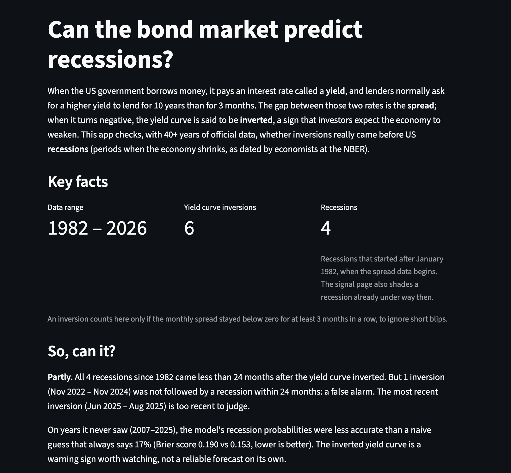
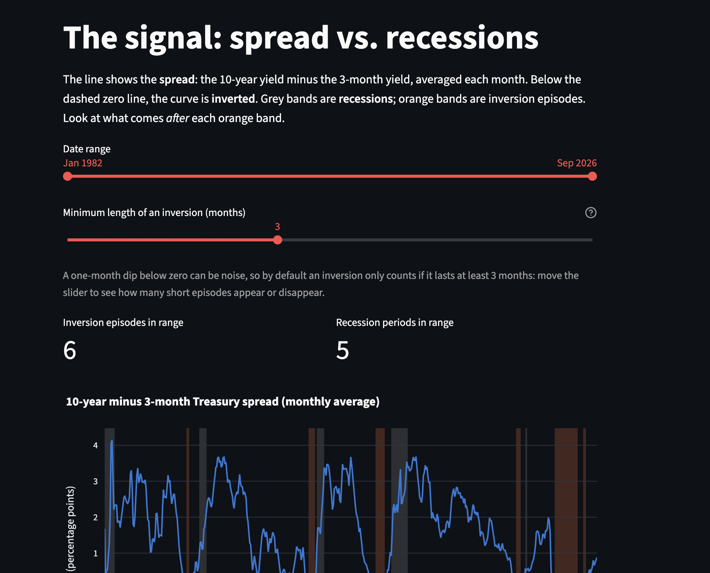
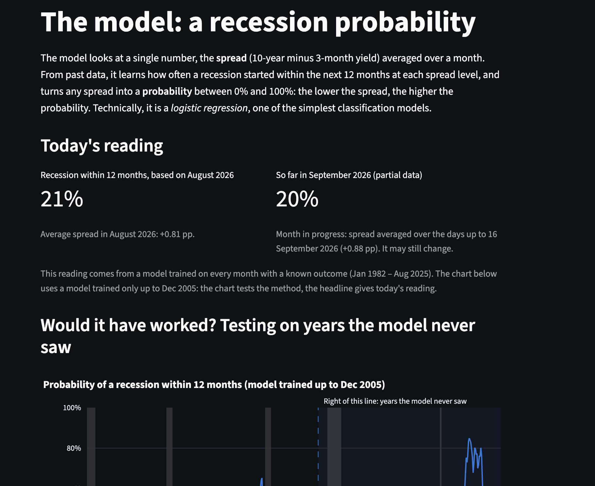

# Can the bond market predict recessions?

[](https://github.com/Alexandre-Le-Bacon/yield-curve-recession/actions/workflows/ci.yml)
[](https://www.python.org/downloads/)
[](LICENSE)
[](https://hub.docker.com/r/alebacon0/yield-curve-recession)

A Streamlit app that explores one of the best-known warning signals in economics:
the **inverted yield curve**.

- A **yield** is the annual interest rate the US government pays to borrow money
  by issuing Treasury bonds.
- Lenders usually ask for a higher yield to lend for longer, so the 10-year yield is
  normally above the 3-month yield. The difference between the two is the
  **spread**.
- When the spread turns negative, short-term borrowing costs more than long-term
  borrowing. This is called a **yield curve inversion**, and it has come before
  every US recession of the past several decades.

The app shows the history of the spread against official recession periods, and fits
a simple model estimating the probability of a recession within the next 12 months.

> Final project for the HEC course *Tooling for the Data Scientist*.

## Screenshots

| Home | The signal | The model |
| ---- | ---------- | --------- |
|  |  |  |

## Status

| Part                                    | Status          |
| --------------------------------------- | --------------- |
| Data download, loading and filtering    | ✅ done          |
| Tests and continuous integration        | ✅ done          |
| Features: spread, inversions, target    | ✅ done          |
| Exploration pages (app v0)              | ✅ done          |
| Recession probability model and method  | ✅ done          |
| Docker image and CI container check     | ✅ done          |

## Quick start

Requirements: [uv](https://docs.astral.sh/uv/). uv installs the right Python
version (3.11) and all dependencies for you. You don't need to install Python yourself.

```bash
# 1. Install uv (macOS / Linux)
curl -LsSf https://astral.sh/uv/install.sh | sh

# 2. Clone the repository and install the exact dependency versions from uv.lock
git clone https://github.com/Alexandre-Le-Bacon/yield-curve-recession.git
cd yield-curve-recession
uv sync

# 3. Run the app, then open http://localhost:8501
uv run streamlit run app/Home.py
```

Always start the app from the repository root with `app/Home.py` as the entry point:
Streamlit then adds `app/` to the import path, which the pages need to import the
shared `app/loaders.py`.

## Run with Docker

No Python or uv needed, only [Docker](https://docs.docker.com/get-docker/). The image
works on `linux/amd64` and `linux/arm64` (Intel/AMD machines and Apple Silicon).

**From Docker Hub:**

```bash
docker pull alebacon0/yield-curve-recession:latest
docker run --rm -p 8501:8501 alebacon0/yield-curve-recession:latest
# then open http://localhost:8501
```

**Build the image locally:**

```bash
docker build -t yield-curve-recession .
docker run --rm -p 8501:8501 yield-curve-recession
```

The container runs as a non-root user and has a `HEALTHCHECK` on Streamlit's
`/_stcore/health` endpoint, so `docker ps` shows when it is ready (usually in a few
seconds). The download is about 250 MB (about 870 MB unpacked); almost all of it is
the scientific Python libraries.

How the image is built (`Dockerfile`):

- **Two stages.** A build stage installs the locked dependencies with uv into a
  virtual environment; the final stage copies only that environment plus `app/`,
  `src/` and `data/raw/`. uv, tests, docs and Git history are not in the final image.
- **Layer caching.** Dependencies are installed from `pyproject.toml` and `uv.lock`
  before the source code is copied, so changing the code does not reinstall them.
- **Locked and pinned.** `uv sync --frozen --no-dev` installs exactly what `uv.lock`
  lists, without development tools; the base image is pinned by digest.

<details>
<summary>Publishing a multi-architecture image (maintainer)</summary>

```bash
docker login
docker buildx build --platform linux/amd64,linux/arm64 \
  --tag alebacon0/yield-curve-recession:latest --push .
```

</details>

## The app

| Page                    | What it shows |
| ----------------------- | ------------- |
| **Home**                | The question, a short explanation for non-finance readers, key facts (data range, number of yield curve inversions lasting at least 3 months, number of recessions since 1982) and a conclusion built from the data: which recessions an inversion preceded, the false alarms, and how the model compared with a naive baseline. |
| **Understand the curve**| The shape of the yield curve (3-month to 30-year yields) for any month since 1982, labelled *normal* or *inverted*. Buttons jump to notable moments (dot-com bubble, before the financial crisis, before Covid, record inversion), each with what happened in the next 24 months, computed from the recession data. |
| **The signal**          | The 10-year minus 3-month spread over time, with a zero line, recessions shaded in grey and inversion episodes in orange. Sliders filter the date range and set the minimum length of an inversion (1 to 6 months). |
| **The model**           | Today's 12-month recession probability (last complete month, plus the month in progress shown separately), a chart of the probability over time from a model that never saw the years after 2006, and its evaluation against a naive baseline. |
| **Data and method**     | Data sources with links, download date, target definition, train/test split with embargo, limitations, a *not financial advice* note, and how to reproduce the results. |

The sidebar shows when the data was downloaded from FRED. Data loading is cached
with `st.cache_data`, so the CSV files are read once per server process.

## Model and method

The question the model answers: *given the spread this month, what is the probability
that a recession month occurs within the next 12 months?*

- **Feature:** the monthly average of the daily 10-year minus 3-month spread.
- **Target:** 1 if at least one month in `(t, t+12]` is a recession month (USREC),
  else 0. The last 12 months of recession data have no known target and are dropped,
  never filled with 0 (no look-ahead).
- **Model:** scikit-learn `LogisticRegression` with a fixed `random_state`.
- **Split:** by time, never shuffled. The cutoff month is 2006-12: training uses
  months up to 2005-12, testing starts in 2007-01. The 12 months in between are an
  **embargo**: their targets depend on recessions after the cutoff, so using them for
  training would leak future information. The embargo length follows the horizon.
- **Evaluation:** ROC AUC and Brier score on the test period, against a naive
  baseline that always predicts the training base rate.
- **Current reading:** a separate model refitted on all labelled months, applied to
  the last complete month; the month in progress is reported apart.

Results with the committed snapshot (downloaded 2026-09-16), test period
Jan 2007 – Aug 2025:

| Metric                          | Model | Naive baseline |
| ------------------------------- | ----- | -------------- |
| ROC AUC (higher is better)      | 0.59  | 0.50           |
| Brier score (lower is better)   | 0.190 | 0.153          |

The model ranks months better than chance, but its probabilities are less accurate
than the baseline. These scores rest on only two recessions (2008–2009 and 2020), and
the long 2022–2024 inversion was not followed by a recession. The app states this
openly: the spread is a warning signal, not a precise forecast. This is not financial
advice.

## Development

Run the same checks as the CI:

```bash
uv run ruff check .                  # lint
uv run ruff format --check .         # formatting (use `uv run ruff format .` to fix)
uv run pytest --cov=src              # tests + coverage (fails below 90%)
```

## Engineering practices

- **Separation of concerns.** All logic lives in `src/yield_curve/` as pure, typed
  functions with Google-style docstrings and no Streamlit import. The pages in `app/`
  only call these functions and display the results.
- **Tests.** Every function in `src/` is tested with small synthetic data, never the
  network: normal cases, edge cases (empty data, missing values, dates outside the
  data) and invalid inputs.
  - *Unit tests:* `tests/test_data.py`, `tests/test_features.py`,
    `tests/test_model.py`, including leakage checks (no train/test overlap, embargoed
    months never used for fitting).
  - *Smoke tests:* `tests/test_app.py` runs every page with Streamlit's `AppTest`,
    starting from `app/Home.py` exactly like `streamlit run` does.
  - *Regression tests:* bugs found while building the app get a test that fails
    without the fix, e.g. a chart losing its date axis, or a page missing from the
    home page links.
- **Coverage threshold.** `pytest --cov` fails below 90% (configured in
  `pyproject.toml`); coverage of `src/` is currently 100%.
- **Linting and formatting.** [ruff](https://docs.astral.sh/ruff/) checks style,
  import order, likely bugs, type hints and docstrings, and enforces one format.
- **Continuous integration.** GitHub Actions (`.github/workflows/ci.yml`) runs two
  jobs on every pull request and every push to `main`:
  - *Lint, format and tests:* ruff and pytest with coverage, after
    `uv sync --locked`.
  - *Docker image builds and runs:* builds the image (nothing is pushed), starts a
    container, waits for its health check to pass, and checks it runs as non-root.
    A broken Dockerfile fails the pull request.
- **Branch protection.** A ruleset on `main` requires a pull request and a passing
  "Lint, format and tests" check before merging, and blocks force pushes.
- **Git history.** One branch per feature (`feat/...`, `fix/...`, `docs/...`),
  small commits with [Conventional Commits](https://www.conventionalcommits.org/)
  messages (`feat:`, `fix:`, `test:`, `docs:`, `ci:`, `build:`, `refactor:`).

## Reproducibility

The same inputs give the same results, on any machine:

- **Locked dependencies.** `uv.lock` records the exact version and hash of every
  package. CI installs with `uv sync --locked`, which fails if the lockfile is out of
  date with `pyproject.toml`; the Docker image installs with `uv sync --frozen`.
- **Pinned tools.** The Python version (3.11) is set in `.python-version` and
  `pyproject.toml`; the uv version is the same in CI and in the Dockerfile.
- **Data snapshots.** The FRED data is committed in `data/raw/`, with the download
  date and series details in `data/raw/metadata.json`. The app never calls the
  network, so results only change when the snapshots are refreshed on purpose.
- **Deterministic model.** No random shuffling: the train/test split is by date,
  and the logistic regression uses a fixed `random_state`.
- **Pinned Docker base image.** `python:3.11-slim` is pinned by its digest, so a
  rebuild uses exactly the same operating system layer on amd64 and arm64.

## Data

All data comes from [FRED](https://fred.stlouisfed.org/), the public database of the
Federal Reserve Bank of St. Louis:

| Series   | Description                                        | Frequency |
| -------- | -------------------------------------------------- | --------- |
| `T10Y3M` | 10-year minus 3-month Treasury spread              | daily     |
| `USREC`  | Recession indicator (1 = recession, dated by NBER) | monthly   |
| `DGS3MO` | 3-month Treasury yield                             | daily     |
| `DGS2`   | 2-year Treasury yield                              | daily     |
| `DGS5`   | 5-year Treasury yield                              | daily     |
| `DGS10`  | 10-year Treasury yield                             | daily     |
| `DGS30`  | 30-year Treasury yield                             | daily     |

Snapshots are committed in `data/raw/`, so the app works offline and results are
reproducible. The download date is recorded in `data/raw/metadata.json`. To refresh
the data:

```bash
uv run python scripts/download_data.py
```

The app reads data from `data/raw/` by default. Set the `YIELD_CURVE_DATA_DIR`
environment variable to use another directory.

## Project layout

```
app/                     Streamlit UI, no business logic
  Home.py                  entry point: question, explanation, key facts
  loaders.py               cached data loading and model results shared by the pages
  charts.py                shared Plotly chart style (date axis, shaded periods)
  pages/                   one file per page
src/yield_curve/         Pure Python logic, no Streamlit imports
  data.py                  load, merge and filter FRED series; download date
  features.py              monthly spread, inversions, recession periods and target
  model.py                 dataset, time split with embargo, logistic regression,
                           evaluation and current reading
scripts/download_data.py Refresh the CSV snapshots from FRED
data/raw/                Committed CSV snapshots + metadata.json
tests/                   pytest suite (no network access)
docs/screenshots/        Screenshots used in this README
Dockerfile               Two-stage image: locked dependencies, non-root, health check
.dockerignore            Keeps the build context small and free of local files
.github/workflows/ci.yml Lint, format, tests and Docker checks
```

## License

MIT, see [LICENSE](LICENSE).
